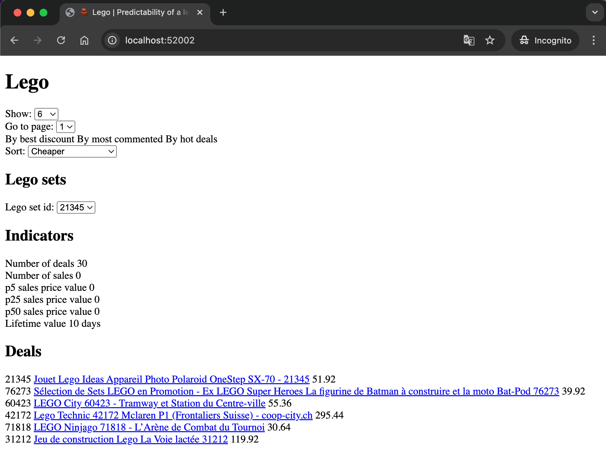
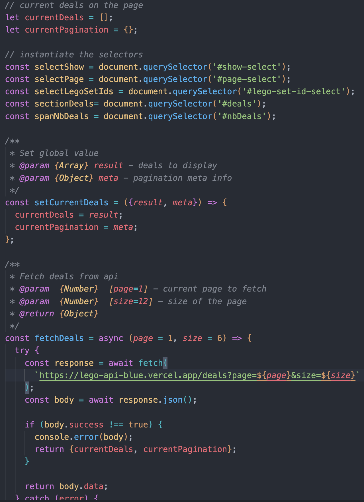

# 🧱 Step 2 - Interact with the Deals and Sales

> How to interact data with JavaScript, HTML and CSS in the browser

<!-- START doctoc generated TOC please keep comment here to allow auto update -->
<!-- DON'T EDIT THIS SECTION, INSTEAD RE-RUN doctoc TO UPDATE -->
**Table of Contents**

- [🎯 Objective](#-objective)
- [🏗 Prerequisites](#%F0%9F%8F%97-prerequisites)
- [📱 Features](#-features)
  - [Feature 0 - Show more](#feature-0---show-more)
  - [Feature 1 - Browse pages](#feature-1---browse-pages)
  - [Feature 2 - Filter by best discount](#feature-2---filter-by-best-discount)
  - [Feature 3 - Filter by most commented](#feature-3---filter-by-most-commented)
  - [Feature 4 - Filter by hot deals](#feature-4---filter-by-hot-deals)
  - [Feature 5 - Sort by price](#feature-5---sort-by-price)
  - [Feature 5 - Sort by date](#feature-5---sort-by-date)
  - [Feature 7 - Display Vinted sales](#feature-7---display-vinted-sales)
  - [Feature 8 - Specific indicators](#feature-8---specific-indicators)
  - [Feature 9 - average, p5, p25 and p50 price value indicators](#feature-9---average-p5-p25-and-p50-price-value-indicators)
  - [Feature 10 - Lifetime value](#feature-10---lifetime-value)
  - [Feature 11 - Open product link](#feature-11---open-product-link)
  - [Feature 12 - Open sold item link](#feature-12---open-sold-item-link)
  - [Feature 13 - Save as favorite](#feature-13---save-as-favorite)
  - [Feature 14 - Filter by favorite](#feature-14---filter-by-favorite)
  - [Feature 15 - Usable and pleasant UX](#feature-15---usable-and-pleasant-ux)
- [👩‍💻 Just tell me what to do](#%E2%80%8D-just-tell-me-what-to-do)
  - [Don't forget. 4 Focus.](#dont-forget-4-focus)
- [🛣️ Related Theme and courses](#-related-theme-and-courses)

<!-- END doctoc generated TOC please keep comment here to allow auto update -->


## 🎯 Objective

**Build an usable and pleasant web page that interacts with arrays, objects, functions etc... with JavaScript, HTML and CSS.**

## 🏗 Prerequisites

1. Be sure **to have a clean working copy**.

This means that you should not have any uncommitted local changes.

```sh
❯ cd /path/to/workspace/lego
❯ git status
On branch master
Your branch is up to date with 'origin/master'.

nothing to commit, working tree clean
```

2. **Pull** the `master` branch to update your local with the new remote changes

```sh
❯ git remote add upstream git@github.com:92bondstreet/lego.git
## or ❯ git remote add upstream https://github.com/92bondstreet/lego
❯ git fetch upstream
❯ git pull --rebase upstream master
```

4. **Open the entry point [../client/v2/index.html](../client/v2/index.html)** in your browser (that loads - among others - the [../client/v2/portfolio.js](../client/v2/portfolio.js) file)

```sh
# macos cli
❯ open client/v2/index.html
# linux cli
❯ xdg-open client/v2/index.html

# or by double-clicking in your browser files
```

5. **Check the rendering of your browser webpage**



## 📱 Features

I will describe each feature with the [Agile User Story template](https://www.agilealliance.org/glossary/user-story-template/).

A [User Story](https://www.atlassian.com/agile/project-management/user-stories) is an informal, general explanation of a software feature written from the perspective of the end user or customer.

A user story should typically have a summary structured this way:

1. **As a** [user concerned by the story]
1. **I want** [goal of the story]
1. **so that** [reason for the story]

### Feature 0 - Show more

As a user<br>
I want to show more deals<br>
So that I can display 6, 12 or 24 deals on the same page

### Feature 1 - Browse pages

As a user<br>
I want to browse available pages<br>
So that I can load more deals

### Feature 2 - Filter by best discount

As a user<br>
I want to filter by best discount<br>
So that I can browse deals with a discount more important than 50%

### Feature 3 - Filter by most commented

As a user<br>
I want to filter by most commented deals<br>
So that I can browse deals with more than 15 comments

### Feature 4 - Filter by hot deals

As a user<br>
I want to filter by hot deals<br>
So that I can browse deals with a temperature more important than 100


### Feature 5 - Sort by price

As a user<br>
I want to sort by price<br>
So that I can easily identify cheapest and expensive deals

### Feature 5 - Sort by date

As a user<br>
I want to sort by date<br>
So that I can easily identify recent and old deals

### Feature 7 - Display Vinted sales

As a user for a given set id<br>
I want to display vinted sales<br>
So that I can easily identify current sales for a given set id

### Feature 8 - Specific indicators

As a user for a given set id<br>
I want to indicate the total number of sales<br>
So that I can understand the sales market

### Feature 9 - average, p5, p25 and p50 price value indicators

As a user for a given set id<br>
I want to indicate the average, p5, p25 and p50 price value<br>
So that I can understand the sales prices for a given set 

### Feature 10 - Lifetime value

As a user for a given set id<br>
I want to indicate the Lifetime value<br>
So that I can understand how long a set exists on Vinted

### Feature 11 - Open product link

As a user<br>
I want to open deal link in a new page<br>
So that I can buy the product easily

### Feature 12 - Open sold item link

As a user<br>
I want to open sold item link in a new page<br>
So that I can understand the sold item easily

### Feature 13 - Save as favorite

As a user<br>
I want to save a deal as favorite<br>
So that I can retreive this deal later

### Feature 14 - Filter by favorite

As a user<br>
I want to filter by favorite deals<br>
So that I can load only my favorite deals

### Feature 15 - Usable and pleasant UX

As a user<br>
I want to parse a usable and pleasant web page<br>
So that I can find valuable and useful content


## 👩‍💻 Just tell me what to do

1. **Solve each `User Stories`** inside [../client/v2/portfolio.js](../client/v2/portfolio.js) file with JavaScript

    


2. Once an User Story is solved, **commit your modification**:

    ```sh
    ❯ cd /path/to/workspace/lego
    ❯ git add -A && git commit -m "feat(display): show 6, 12 or 24 deals"
    ```

    ([why following a commit message convention?](https://dev.to/chrissiemhrk/git-commit-message-5e21))

3. **Commit early, commit often**
4. Don't forget **to push before the end of the workshop**

    ```sh
    ❯ git push origin master
    ```

    **Note**: if you catch an error about authentication, [add your ssh to your github profile](https://help.github.com/articles/connecting-to-github-with-ssh/).

10. Check that your codebase works by checking the console output
11. If you need some helps on git commands, read [git - the simple guide](http://rogerdudler.github.io/git-guide/)

### Don't forget. 4 Focus.

* DOT - Do One Thing
* LIM - Less Is More
* If you change the [../client/v2/index.html](../client/v2/index.html) selectors, you should probably update [../client/v2/portfolio.js](../client/v2/portfolio.js) file
* English only: codebase, variables, comments...

**Focus on coding and web design**


## 🛣️ Related Theme and courses

* 🏁 [Theme 1 - About Javascript](https://github.com/92bondstreet/inception/blob/master/themes/1.md#about-javascript)
* 🏁 [Theme 1 - About HTML/CSS](https://github.com/92bondstreet/inception/blob/master/themes/1.md#about-htmlcss)
