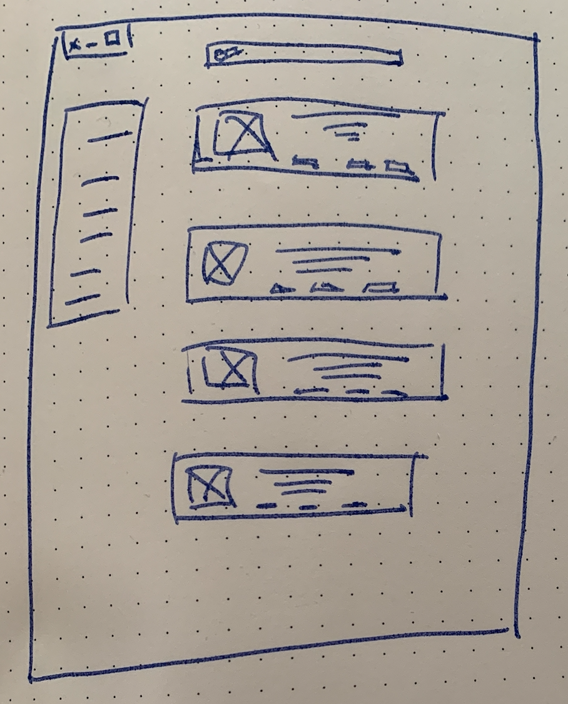

# 🎨 Step 3 - Be an advocate for your design

> How to explain why you created all of your design?

<!-- START doctoc generated TOC please keep comment here to allow auto update -->
<!-- DON'T EDIT THIS SECTION, INSTEAD RE-RUN doctoc TO UPDATE -->
**Table of Contents**

- [🎯 Objective](#-objective)
- [🏗 Prerequisites](#%F0%9F%8F%97-prerequisites)
- [🎨 Design Review?](#-design-review)
- [👩‍💻 Just tell me what to do](#%E2%80%8D-just-tell-me-what-to-do)

<!-- END doctoc generated TOC please keep comment here to allow auto update -->

## 🎯 Objective

**Be prepped for real-world design critiques - with kindness - in your design process.**

## 🏗 Prerequisites

1. Be sure **to have a clean working copy**.

This means that you should not have any uncommitted local changes.

```sh
❯ cd /path/to/workspace/lego
❯ git status
On branch master
Your branch is up to date with 'origin/master'.

nothing to commit, working tree clean
```

2. **Pull** the `master` branch to update your local with the new remote changes

```sh
❯ git remote add upstream git@github.com:92bondstreet/lego.git
## or ❯ git remote add upstream https://github.com/92bondstreet/lego
❯ git fetch upstream
❯ git pull --rebase upstream master
```

## 🎨 Design Review?

A design review is a dedicated session with peers - or any kind of group - to get you comfortable with presenting your work.

## 👩‍💻 Just tell me what to do

Update the [REVIEW.md](../design/REVIEW.md) file sections by answering following questions:

### About reasoning and decision-making

* Could you share - at least 1 - low-fidelity sketches?
        

* Could you give at least 3 considerations - you've taken account - when you created your sketches/design.

### About the problem statement

* What main problem are you solving for?

* What does success - I mean problem resolution - look like? How will it be measured?

### About patterns and conviction in the solutions

* Comment on - at least 4 - visual aspects such as: layout, spacing, color choice, font choice, icons etc.

* Comment on - least 3 interaction patterns - such as: radio buttons vs checkboxes, breadcrumb, colors for active/inactive button etc. 


