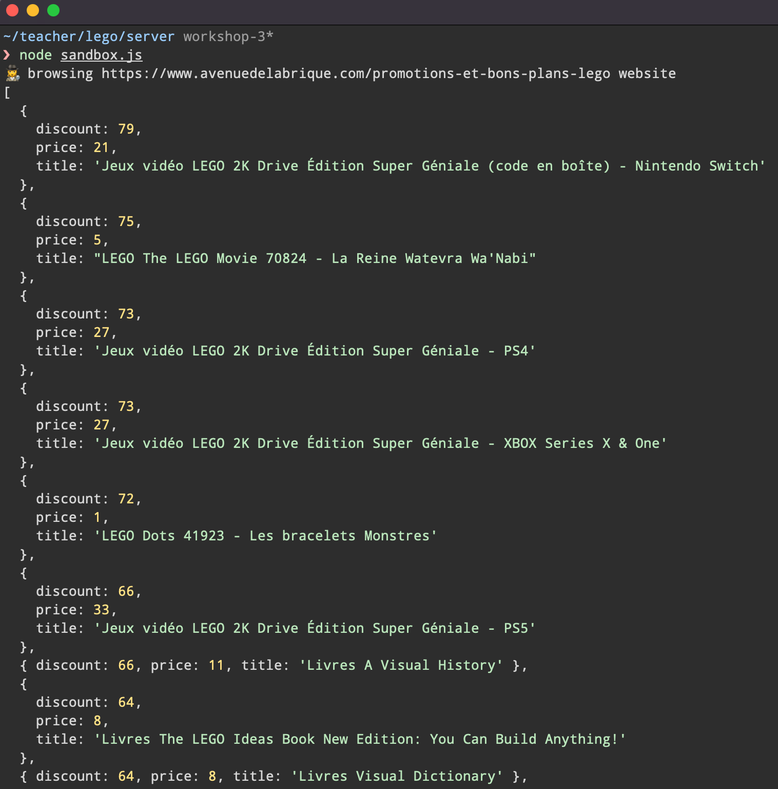
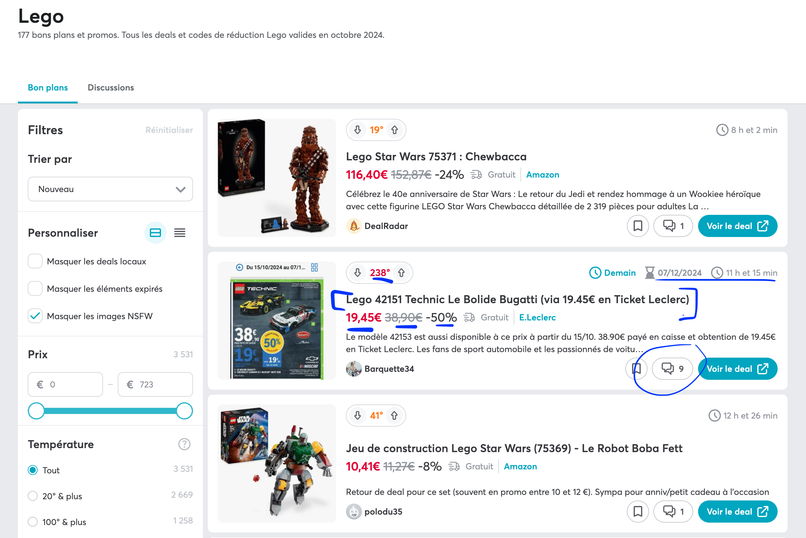
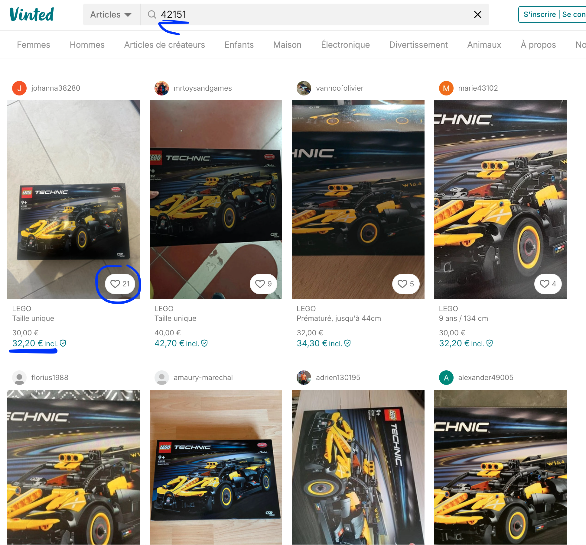

# 🧹 Step 3 - Scrape the Deals and the Sales

> How to manipulate and data with JavaScript from server side

<!-- START doctoc generated TOC please keep comment here to allow auto update -->
<!-- DON'T EDIT THIS SECTION, INSTEAD RE-RUN doctoc TO UPDATE -->
**Table of Contents**

- [🎯 Objective](#-objective)
- [🏗 Prerequisites](#%F0%9F%8F%97-prerequisites)
- [📱 How to scrape with Node.js? 1 example to do it](#-how-to-scrape-with-nodejs-1-example-to-do-it)
  - [Step 1. No code, Investigation first](#step-1-no-code-investigation-first)
  - [Step 2. Server-side with Node.js](#step-2-server-side-with-nodejs)
- [📦 Suggested node modules](#-suggested-node-modules)
- [🧱 A complete Scraping Example for avenuedelabrique.com](#%F0%9F%A7%B1-a-complete-scraping-example-for-avenuedelabriquecom)
- [👩‍💻 Just tell me what to do](#%E2%80%8D-just-tell-me-what-to-do)
  - [Step 1 - Scrape `Deals` from dealabs.com](#step-1---scrape-deals-from-dealabscom)
  - [Step 2 - Scrape `Sales` from vinted.fr](#step-2---scrape-sales-from-vintedfr)
  - [Commit your modification](#commit-your-modification)
- [🛣️ Related Theme and courses](#-related-theme-and-courses)

<!-- END doctoc generated TOC please keep comment here to allow auto update -->


## 🎯 Objective

**Scrape deals and sales with Node.js - for educational purpose - and use JavaScript as server-side scripting to manipulate and interact with array, objects, functions...**

## 🏗 Prerequisites

1. Be sure **to have a clean working copy**.

    This means that you should not have any uncommitted local changes.

    ```sh
    ❯ cd /path/to/workspace/lego
    ❯ git status
    On branch master
    Your branch is up to date with 'origin/master'.

    nothing to commit, working tree clean
    ```

2. **Pull** the `master` branch to update your local with the new remote changes

    ```sh
    ❯ git remote add upstream git@github.com:92bondstreet/lego.git
    ## or ❯ git remote add upstream https://github.com/92bondstreet/lego
    ❯ git fetch upstream
    ❯ git pull --rebase upstream master
    ```

3. **Check the terminal output for the command `node sandbox.js`**

    ```sh
    ❯ cd /path/to/workspace/lego/server
    ## install dependencies
    ❯ npm install
    ❯ node sandbox.js
    ```

    

    **sandox** - in programming - usually refers to the execution of your programs for independent evaluation, monitoring or testing.

    It means when we call `node sandbox.js`, we want to test some piece of codes in insolation.

4. **If nothing happens or errors occur**, check your [node server installation (from Theme 2)](https://github.com/92bondstreet/inception/blob/master/themes/2.md#-just-tell-me-what-to-do)

## 📱 How to scrape with Node.js? 1 example to do it

Let's try to scrape deals from website [Avenue de la brique](https://www.avenuedelabrique.com/promotions-et-bons-plans-lego).


### Step 1. No code, Investigation first

1. Browse the website
1. How does the website https://www.avenuedelabrique.com/promotions-et-bons-plans-lego work?
1. How can I access to the different deals pages?
1. What is a `Deal`? What are the given properties for a `Deal`: title, price, discount, link...?
1. Check how that you can get list of Deals: web page itself, api etc.... (Inspect Network Activity - with [Chrome DevTools for instance](https://developer.chrome.com/docs/devtools/network/) - on any browser)
1. Define the JSON object representation for a Deal
1. ...
1. ...


### Step 2. Server-side with Node.js

Create a module called `avenuedelabrique` that returns the list of `Deals` for a given url page of [Avenue de la brique](https://www.avenuedelabrique.com/promotions-et-bons-plans-lego).

Example of page to scrape: https://www.avenuedelabrique.com/promotions-et-bons-plans-lego


```js
// Following lines are pseudo-code
const avenuedelabrique = require('avenuedelabrique');

const deals = avenuedelabrique.scrape('https://www.avenuedelabrique.com/promotions-et-bons-plans-lego');

deals.forEach(deal => {
  console.log(deal.title);
})
```

## 📦 Suggested node modules

* [node-fetch](https://github.com/node-fetch/node-fetch) - A light-weight module that brings Fetch API to Node.js.
* [cheerio](https://github.com/cheeriojs/cheerio) - The fast, flexible, and elegant library for parsing and manipulating HTML and XML.
* [nodemon](https://github.com/remy/nodemon) - Monitor for any changes in your node.js application and automatically restart the server - perfect for development.

## 🧱 A complete Scraping Example for avenuedelabrique.com

[server/websites/avenuedelabrique.js](../server/websites/avenuedelabrique.js) contains a function to scrape a given [Avenue de la brique](https://www.avenuedelabrique.com/) deals page.

To start the example, call with `node` cli or use the `Makefile` target:

```sh
❯ cd /path/to/workspace/lego/server
❯ node sandbox.js
❯ node sandbox.js "https://www.avenuedelabrique.com/promotions-et-bons-plans-lego"
❯ ## make sandbox
❯ ## ./node_modules/.bin/nodemon sandbox.js
```


```js
const fetch = require('node-fetch');
const cheerio = require('cheerio');

/**
 * Parse webpage data response
 * @param  {String} data - html response
 * @return {Object} deal
 */
const parse = data => {
  const $ = cheerio.load(data, {'xmlMode': true});

  return $('div.prods a')
    .map((i, element) => {
      const price = parseInt(
        $(element)
          .find('span.prodl-prix span')
          .text()
      );

      const discount = Math.abs(parseInt(
        $(element)
          .find('span.prodl-reduc')
          .text()
      ));

      return {
        discount,
        price,
        'title': $(element).attr('title'),
      };
    })
    .get();
};

/**
 * Scrape a given url page
 * @param {String} url - url to parse
 * @returns 
 */
module.exports.scrape = async url => {
  const response = await fetch(url);

  if (response.ok) {
    const body = await response.text();

    return parse(body);
  }

  console.error(response);

  return null;
};
```


## 👩‍💻 Just tell me what to do


### Step 1 - Scrape `Deals` from dealabs.com

1. How does the website https://www.dealabs.com/ work? How can I access to the different deals pages and items? What is a `Deal`? What are the given properties for a `Deal`: title, price, discount, link...?
1. **Scrape Lego deals** from Dealabs
1. **Store the list into a JSON file**



### Step 2 - Scrape `Sales` from vinted.fr
1. How does the website https://www.vinted.fr/ work? How can I access to the different sales pages and items? What is a `Sale`? What are the given properties for a `Sale`: title, price, link...?
1. **Scrape Vinted sales** from Vinted for a given lego set id
1. **Store the list into a JSON file**



### Commit your modification

```sh
❯ cd /path/to/workspace/lego
❯ git add -A && git commit -m "feat(dealabs): scrape new deals"
```

([why following a commit message convention?](https://dev.to/chrissiemhrk/git-commit-message-5e21))

1. **Commit early, commit often**
1. Don't forget **to push before the end of the workshop**

    ```sh
    ❯ git push origin master
    ```

    **Note**: if you catch an error about authentication, [add your ssh to your github profile](https://help.github.com/articles/connecting-to-github-with-ssh/).

1. If you need some helps on git commands, read [git - the simple guide](http://rogerdudler.github.io/git-guide/)


## 🛣️ Related Theme and courses

* 🏗 [Theme 2 - About Node.js](https://github.com/92bondstreet/inception/blob/master/themes/2.md#about-nodejs)
