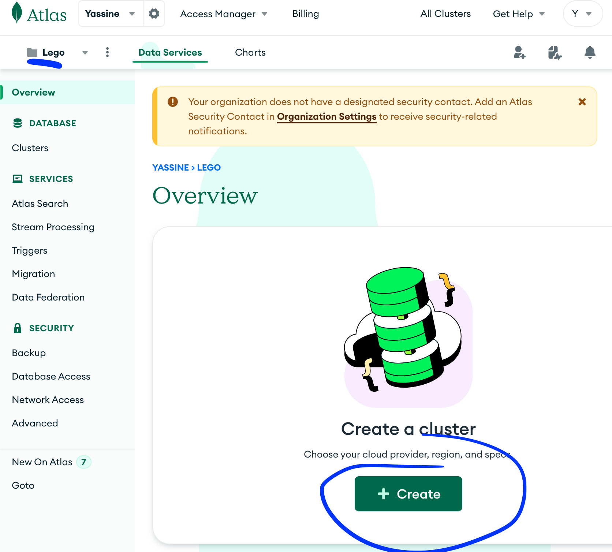

# 💽 Step 5 - Store the Deals and the Sales

> How to avoid to scrape again and again the same data

<!-- START doctoc generated TOC please keep comment here to allow auto update -->
<!-- DON'T EDIT THIS SECTION, INSTEAD RE-RUN doctoc TO UPDATE -->
**Table of Contents**

- [🎯 Objective](#-objective)
- [🏗 Prerequisites](#%F0%9F%8F%97-prerequisites)
- [👩‍💻 Just tell me what to do](#%E2%80%8D-just-tell-me-what-to-do)
- [📦 Suggested node modules](#-suggested-node-modules)

<!-- END doctoc generated TOC please keep comment here to allow auto update -->


## 🎯 Objective

**Store deals and sales in a database with node.js to create, read, update or delete data...**

## 🏗 Prerequisites

1. Be sure **to have a clean working copy**.

This means that you should not have any uncommitted local changes.

```sh
❯ cd /path/to/workspace/lego
❯ git status
On branch master
Your branch is up to date with 'origin/master'.

nothing to commit, working tree clean
```

2. **Pull** the `master` branch to update your local with the new remote changes

```sh
❯ git remote add upstream git@github.com:92bondstreet/lego.git
## or ❯ git remote add upstream https://github.com/92bondstreet/lego
❯ git fetch upstream
❯ git pull upstream master
```


## 👩‍💻 Just tell me what to do

1. **Create a free account on [MongoDB Atlas](https://www.mongodb.com/products/platform/atlas-database)**, Database as a Service (DBaaS) Provider.

2. **Create a new project called Lego and deploy a cluster. [MongoDB Cluster](https://docs.atlas.mongodb.com/tutorial/create-new-cluster/)**

    

    

    


3. **Connect** your node.js server script

    ```js
    const {MongoClient} = require('mongodb');
    const MONGODB_URI = 'mongodb+srv://<user>:<password>@<cluster-url>?retryWrites=true&writeConcern=majority';
    const MONGODB_DB_NAME = 'lego';
    ...

    const client = await MongoClient.connect(MONGODB_URI, {'useNewUrlParser': true});
    const db =  client.db(MONGODB_DB_NAME)

    ...

    ```

4. **Insert the deals and sales** into this database


    ```js
    const deals = [];

    ...

    const collection = db.collection('deals');
    const result = collection.insertMany(deals);

    console.log(result);
    ```

5. **Create at least 6 methods** to find deals and sales according MongoDB queries.

    These 6 methods should

    - Find all best discount deals 
    - Find all most commented deals
    - Find all deals sorted by price
    - Find all deals sorted by date
    - Find all sales for a given lego set id
    - Find all sales scraped less than 3 weeks
    - ...


    ```js
    const legoSetId = '42156';
    ...

    const collection = db.collection('sales');
    const sales = await collection.find({legoSetId}).toArray();

    ...

    console.log(sales);
    ```


6.  **Commit your modification**

    ```sh
    ❯ cd /path/to/workspace/lego
    ❯ git add -A && git commit -m "feat(new-deals): insert all new deals"
    ```

    ([why following a commit message convention?](https://dev.to/chrissiemhrk/git-commit-message-5e21))

7. **Commit early, commit often**
8. Don't forget **to push before the end of the workshop**

    ```sh
    ❯ git push origin master
    ```

    **Note**: if you catch an error about authentication, [add your ssh to your github profile](https://help.github.com/articles/connecting-to-github-with-ssh/).

    If you need some helps on git commands, read [git - the simple guide](http://rogerdudler.github.io/git-guide/)

## 📦 Suggested node modules

- [dotenv](https://www.npmjs.com/package/dotenv) - Loads environment variables from .env for nodejs projects
- [mongodb](https://www.npmjs.com/package/mongodb) - Mongo DB Native NodeJS Driver
