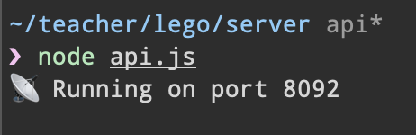
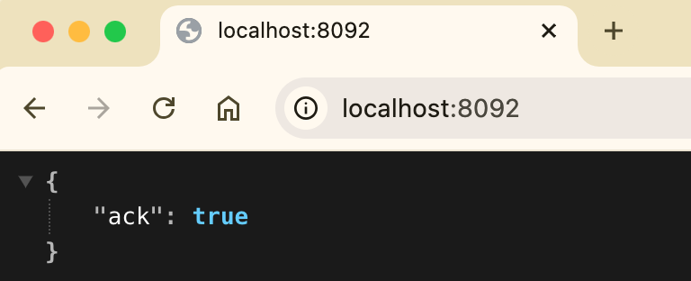
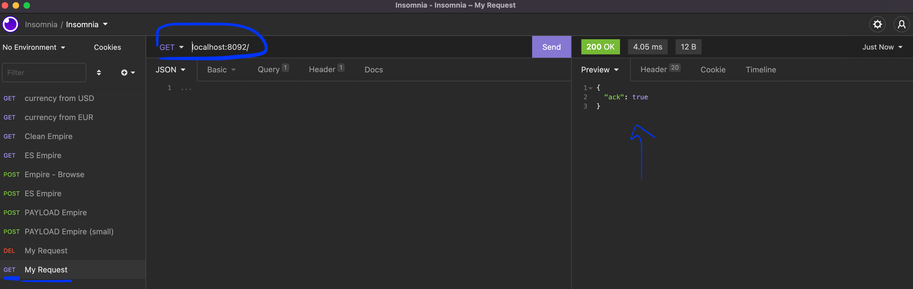

# ⤵️ Step 6 - Request the Deals and the Sales

> How to give access to your data

<!-- START doctoc generated TOC please keep comment here to allow auto update -->
<!-- DON'T EDIT THIS SECTION, INSTEAD RE-RUN doctoc TO UPDATE -->


- [🎯 Objective](#-objective)
- [🏗 Prerequisites](#%F0%9F%8F%97-prerequisites)
- [⤵️ List of endpoints to implement](#-list-of-endpoints-to-implement)
    - [`GET /deals/:id`](#get-dealsid)
    - [`GET /deals/search`](#get-dealssearch)
    - [`GET /sales/search`](#get-salessearch)
- [👩‍💻 Just tell me what to do](#%E2%80%8D-just-tell-me-what-to-do)
- [📦 Suggested node modules](#-suggested-node-modules)

<!-- END doctoc generated TOC please keep comment here to allow auto update -->

## 🎯 Objective

**Build an api with Express to request data from your database...**

## 🏗 Prerequisites

1. Be sure **to have a clean working copy**.

    This means that you should not have any uncommitted local changes.

    ```sh
    ❯ cd /path/to/workspace/lego
    ❯ git status
    On branch master
    Your branch is up to date with 'origin/master'.

    nothing to commit, working tree clean
    ```

2. **Pull** the `master` branch to update your local with the new remote changes

    ```sh
    ❯ git remote add upstream git@github.com:92bondstreet/lego.git
    ## or ❯ git remote add upstream https://github.com/92bondstreet/lego
    ❯ git fetch upstream
    ❯ git pull upstream master
    ```

3. **Check the terminal output for the command `node api.js`**

    ```sh
    ❯ cd /path/to/workspace/lego/server
    ## install new dependencies
    ❯ npm install
    ## or ❯ yarn
    ❯ node api.js
    ```

    

    

## ⤵️ List of endpoints to implement

#### `GET /deals/:id`

Fetch a specific deal.

```sh
❯ curl -H "Accept: application/json" http://localhost:8092/deals/9f778cb0-19f5-59d7-8e2a-4d945627d43e
{
  "_id": "9f778cb0-19f5-59d7-8e2a-4d945627d43e"
  "link": "https://www.dealabs.com/bons-plans/lego-harry-potter-le-chateau-et-le-domaine-de-poudlard-76419-via-3498-sur-la-carte-fidelite-3014312",
  "retail": 139.9,
  "price": 104.92,
  "discount": 25,
  "temperature": 159.27,
  "photo": "https://static-pepper.dealabs.com/threads/raw/atFEj/3014312_1/re/300x300/qt/60/3014312_1.jpg",
  "comments": 4,
  "published": 1741307146,
  "title": "Jeu de construction Lego Harry Potter - Le Château et le Domaine de Poudlard 76419 (Via 34,98€ fidélité)",
  "id": "76419",
  "community": "dealabs",
  ...
}
```

#### `GET /deals/search`

Search for specific deals

This endpoint accepts **at least** the following optional query string parameters:

- `limit` - number of deals to return (default: 12)
- `price` - filter by price (default: All price)
- `date` - filter by date (default: All date)
- `filterBy` - filter by specific values. Possible values:
 `best-discount`|`most-commented` ...
- ...

The results array should be sorted by price in ascending way.

```sh
❯ curl -H "Accept: application/json" http://localhost:8092/deals/search?limit=10&price=25&date=2025-03-01
{
  "limit": 10,
  "total": 5,
  "results": [
    {
      "_id": "8af44c86-9dbf-54e5-88b7-5f4968b79237",
      "link": "https://www.dealabs.com/bons-plans/lego-duplo-10981-la-carotte-qui-pousse-jouet-a-empiler-via-50-cagnottes-3013870",
      "retail": 9.9,
      "price": 4.95,
      "discount": 50,
      "temperature": 59.17,
      "photo": "https://static-pepper.dealabs.com/threads/raw/1haEp/3013870_1/re/300x300/qt/60/3013870_1.jpg",
      "comments": 0,
      "published": 1741258964,
      "title": "Lego Duplo 10981 La Carotte qui Pousse (Via 4,95€ sur la Carte de Fidélité - Sélection de magasins)",
      "id": "10981",
      "community": "dealabs",
    },
    {
      "_id": "2f55f254-daf6-5e67-8545-03ee33fb86e6",
      "link": "https://www.dealabs.com/bons-plans/lego-speed-champions-la-voiture-de-course-de-formule-1-mclaren-2023-3015577",
      "retail": 18.6,
      "price": 17.99,
      "discount": 3,
      "temperature": 55.92,
      "photo": "https://static-pepper.dealabs.com/threads/raw/0b26R/3015577_1/re/300x300/qt/60/3015577_1.jpg",
      "comments": 5,
      "published": 1741508742,
      "title": "LEGO Speed Champions 76919 - La Voiture de Course de Formule 1 McLaren 2023",
      "id": "76919",
      "community": "dealabs",
    },
    {
      ...
    },
    {
      ...
    },
    {
      ...
    }
  ]
}
```

#### `GET /sales/search`

Search for specific sales

This endpoint accepts **at least** the following optional query string parameters:

- `limit` - number of sales to return (default: 12)
- `legoSetId` - filter by a specific lego set id
- ...

The results array should be sorted by date in descending way.

```sh
❯ curl -H "Accept: application/json" http://localhost:8092/deals/search?legoSetId=42156
{
  "limit": 12,
  "total": 12,
  "results": [
    {
      {
        "_id": 'ee27f120-956e-56fb-81a4-e4e6183d66cd',
        "link": 'https://www.vinted.fr/items/5091013043-supporto-da-muro-per-lego-peugeot',
        "price": '7.0',
        "title": 'Supporto da muro per lego Peugeot',
        "published": 1727028413,
      },
      {
        "_id":: 'ba4a61d9-6638-576b-a247-fbcfe77602dc',
        "link": 'https://www.vinted.fr/items/5923778458-lego-technic-42156-peugeot-9x8',
        "price": '105.7',
        "title": 'Lego technic 42156 Peugeot 9x8',
        "published": 1741275629,
      },
      {
        "_id": '649c7047-1e8b-5410-8ba0-3f6d222eb844',
        "link": 'https://www.vinted.fr/items/5939490617-lego-technic-42156-peugeot-9x8-24h-de-mans-neuf',
        "price": '147.7',
        "title": 'Lego technic 42156 Peugeot 9x8 24h de Mans neuf',
        "published": 1741531161,
      }
    {
      ...
    },
    {
      ...
    },
    {
      ...
    }
  ]
}
```


## 👩‍💻 Just tell me what to do

1. **Install the desktop API client to make easier your api development** [Insomnia](https://insomnia.rest)

2. **Check the API endpoint** [`/`](../server/api.js) with insomnia

    

3. **Implement the endpoints**

4. **Check the API request and response with insomnia**

5. **Commit your modification**

    ```sh
    ❯ cd /path/to/workspace/lego
    ❯ git add -A && git commit -m "feat(get-deal): get a specific deal"
    ```

    ([why following a commit message convention?](https://dev.to/chrissiemhrk/git-commit-message-5e21))

5. **Commit early, commit often**
6. Don't forget **to push before the end of the workshop**

    ```sh
    ❯ git push origin master
    ```

    **Note**: if you catch an error about authentication, [add your ssh to your github profile](https://help.github.com/articles/connecting-to-github-with-ssh/).

    If you need some helps on git commands, read [git - the simple guide](http://rogerdudler.github.io/git-guide/)

## 📦 Suggested node modules

- [dotenv](https://www.npmjs.com/package/dotenv) - Loads environment variables from .env for nodejs projects
- [express](https://www.npmjs.com/package/express) - Fast, unopinionated, minimalist web framework for node
- [nodemon](https://www.npmjs.com/package/nodemon) - Monitor for any changes in your node.js application and automatically restart the server - perfect for development
